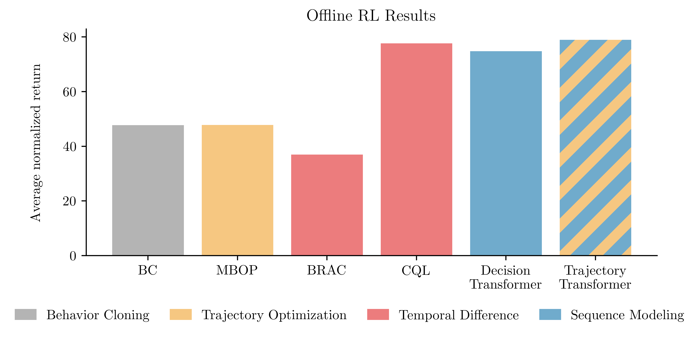

# Trajectory Transformer

Code release for [Offline Reinforcement Learning as One Big Sequence Modeling Problem](https://arxiv.org/abs/2106.02039).

**New:** Also see [Alexander Nikulin's fork](https://github.com/Howuhh/faster-trajectory-transformer) with attention caching and vectorized rollouts!

## Installation

All python dependencies are in [`environment.yml`](environment.yml). Install with:

```
conda env create -f environment.yml
conda activate trajectory
pip install -e .
```

For reproducibility, we have also included system requirements in a [`Dockerfile`](azure/Dockerfile) (see [installation instructions](#Docker)), but the conda installation should work on most standard Linux machines.

## Usage

Train a transformer with: `python scripts/train.py --dataset halfcheetah-medium-v2`

To reproduce the offline RL results: `python scripts/plan.py --dataset halfcheetah-medium-v2`

By default, these commands will use the hyperparameters in [`config/offline.py`](config/offline.py). You can override them with runtime flags:
```
python scripts/plan.py --dataset halfcheetah-medium-v2 \
	--horizon 5 --beam_width 32
```

A few hyperparameters are different from those listed in the paper because of changes to the discretization strategy. These hyperparameters will be updated in the next arxiv version to match what is currently in the codebase.

## Pretrained models

We have provided [pretrained models](https://www.dropbox.com/sh/r09lkdoj66kx43w/AACbXjMhcI6YNsn1qU4LParja?dl=0) for 16 datasets: `{halfcheetah, hopper, walker2d, ant}-{expert-v2, medium-expert-v2, medium-v2, medium-replay-v2}`. Download them with `./pretrained.sh`

The models will be saved in `logs/$DATASET/gpt/pretrained`. To plan with these models, refer to them using the `gpt_loadpath` flag:
```
python scripts/plan.py --dataset halfcheetah-medium-v2 \
	--gpt_loadpath gpt/pretrained
```

`pretrained.sh` will also download 15 [plans](https://www.dropbox.com/sh/po0nul2u6qk8r2i/AABPDrOEJplQ8JT13DASdOWWa?dl=0) from each model, saved to `logs/$DATASET/plans/pretrained`. Read them with `
python plotting/read_results.py`.

<details>
<summary>To create the table of offline RL results from the paper, run <code>python plotting/table.py</code>. This will print a table that can be copied into a Latex document. (Expand to view table source.)</summary>

```
\begin{table*}[h]
\centering
\small
\begin{tabular}{llrrrrrr}
\toprule
\multicolumn{1}{c}{\bf Dataset} & \multicolumn{1}{c}{\bf Environment} & \multicolumn{1}{c}{\bf BC} & \multicolumn{1}{c}{\bf MBOP} & \multicolumn{1}{c}{\bf BRAC} & \multicolumn{1}{c}{\bf CQL} & \multicolumn{1}{c}{\bf DT} & \multicolumn{1}{c}{\bf TT (Ours)} \\
\midrule
Medium-Expert & HalfCheetah & $59.9$ & $105.9$ & $41.9$ & $91.6$ & $86.8$ & $95.0$ \scriptsize{\raisebox{1pt}{$\pm 0.2$}} \\
Medium-Expert & Hopper & $79.6$ & $55.1$ & $0.9$ & $105.4$ & $107.6$ & $110.0$ \scriptsize{\raisebox{1pt}{$\pm 2.7$}} \\
Medium-Expert & Walker2d & $36.6$ & $70.2$ & $81.6$ & $108.8$ & $108.1$ & $101.9$ \scriptsize{\raisebox{1pt}{$\pm 6.8$}} \\
Medium-Expert & Ant & $-$ & $-$ & $-$ & $-$ & $-$ & $116.1$ \scriptsize{\raisebox{1pt}{$\pm 9.0$}} \\
\midrule
Medium & HalfCheetah & $43.1$ & $44.6$ & $46.3$ & $44.0$ & $42.6$ & $46.9$ \scriptsize{\raisebox{1pt}{$\pm 0.4$}} \\
Medium & Hopper & $63.9$ & $48.8$ & $31.3$ & $58.5$ & $67.6$ & $61.1$ \scriptsize{\raisebox{1pt}{$\pm 3.6$}} \\
Medium & Walker2d & $77.3$ & $41.0$ & $81.1$ & $72.5$ & $74.0$ & $79.0$ \scriptsize{\raisebox{1pt}{$\pm 2.8$}} \\
Medium & Ant & $-$ & $-$ & $-$ & $-$ & $-$ & $83.1$ \scriptsize{\raisebox{1pt}{$\pm 7.3$}} \\
\midrule
Medium-Replay & HalfCheetah & $4.3$ & $42.3$ & $47.7$ & $45.5$ & $36.6$ & $41.9$ \scriptsize{\raisebox{1pt}{$\pm 2.5$}} \\
Medium-Replay & Hopper & $27.6$ & $12.4$ & $0.6$ & $95.0$ & $82.7$ & $91.5$ \scriptsize{\raisebox{1pt}{$\pm 3.6$}} \\
Medium-Replay & Walker2d & $36.9$ & $9.7$ & $0.9$ & $77.2$ & $66.6$ & $82.6$ \scriptsize{\raisebox{1pt}{$\pm 6.9$}} \\
Medium-Replay & Ant & $-$ & $-$ & $-$ & $-$ & $-$ & $77.0$ \scriptsize{\raisebox{1pt}{$\pm 6.8$}} \\
\midrule
\multicolumn{2}{c}{\bf Average (without Ant)} & 47.7 & 47.8 & 36.9 & 77.6 & 74.7 & 78.9 \hspace{.6cm} \\
\multicolumn{2}{c}{\bf Average (all settings)} & $-$ & $-$ & $-$ & $-$ & $-$ & 82.2 \hspace{.6cm} \\
\bottomrule
\end{tabular}
\label{table:d4rl}
\end{table*}
```


</details>

<details>
<summary>
To create the average performance plot, run <code>python plotting/plot.py</code>.
<!-- The plot will be saved to <a href="plotting/bar.png"><code>plotting/bar.png</code></a>. -->
(Expand to view plot.)</summary>
<br>


</details>

## Docker

Copy your MuJoCo key to the Docker build context and build the container:
```
cp ~/.mujoco/mjkey.txt azure/files/
docker build -f azure/Dockerfile . -t trajectory
```

Test the container:
```
docker run -it --rm --gpus all \
	--mount type=bind,source=$PWD,target=/home/code \
	--mount type=bind,source=$HOME/.d4rl,target=/root/.d4rl \
	trajectory \
	bash -c \
	"export PYTHONPATH=$PYTHONPATH:/home/code && \
	python /home/code/scripts/train.py --dataset hopper-medium-expert-v2 --exp_name docker/"
```

## Running on Azure

#### Setup

1. Launching jobs on Azure requires one more python dependency:
```
pip install git+https://github.com/JannerM/doodad.git@janner
```

2. Tag the image built in [the previous section](#Docker) and push it to Docker Hub:
```
export DOCKER_USERNAME=$(docker info | sed '/Username:/!d;s/.* //')
docker tag trajectory ${DOCKER_USERNAME}/trajectory:latest
docker image push ${DOCKER_USERNAME}/trajectory
```

3. Update [`azure/config.py`](azure/config.py), either by modifying the file directly or setting the relevant [environment variables](azure/config.py#L47-L52). To set the `AZURE_STORAGE_CONNECTION` variable, navigate to the `Access keys` section of your storage account. Click `Show keys` and copy the `Connection string`.

4. Download [`azcopy`](https://docs.microsoft.com/en-us/azure/storage/common/storage-use-azcopy-v10): `./azure/download.sh`

#### Usage

Launch training jobs with `python azure/launch_train.py` and planning jobs with `python azure/launch_plan.py`.

These scripts do not take runtime arguments. Instead, they run the corresponding scripts ([`scripts/train.py`](scripts/train.py) and [`scripts/plan.py`](scripts/plan.py), respectively) using the Cartesian product of the parameters in [`params_to_sweep`](azure/launch_train.py#L36-L38).

#### Viewing results

To rsync the results from the Azure storage container, run `./azure/sync.sh`.

To mount the storage container:
1. Create a blobfuse config with `./azure/make_fuse_config.sh`
2. Run `./azure/mount.sh` to mount the storage container to `~/azure_mount`

To unmount the container, run `sudo umount -f ~/azure_mount; rm -r ~/azure_mount`

## Reference
```
@inproceedings{janner2021sequence,
  title = {Offline Reinforcement Learning as One Big Sequence Modeling Problem},
  author = {Michael Janner and Qiyang Li and Sergey Levine},
  booktitle = {Advances in Neural Information Processing Systems},
  year = {2021},
}
```

## Acknowledgements

The GPT implementation is from Andrej Karpathy's [minGPT](https://github.com/karpathy/minGPT) repo.
